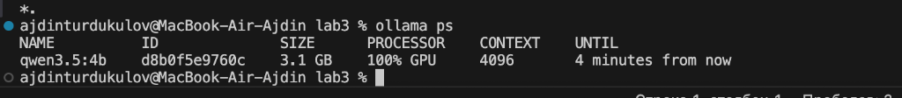
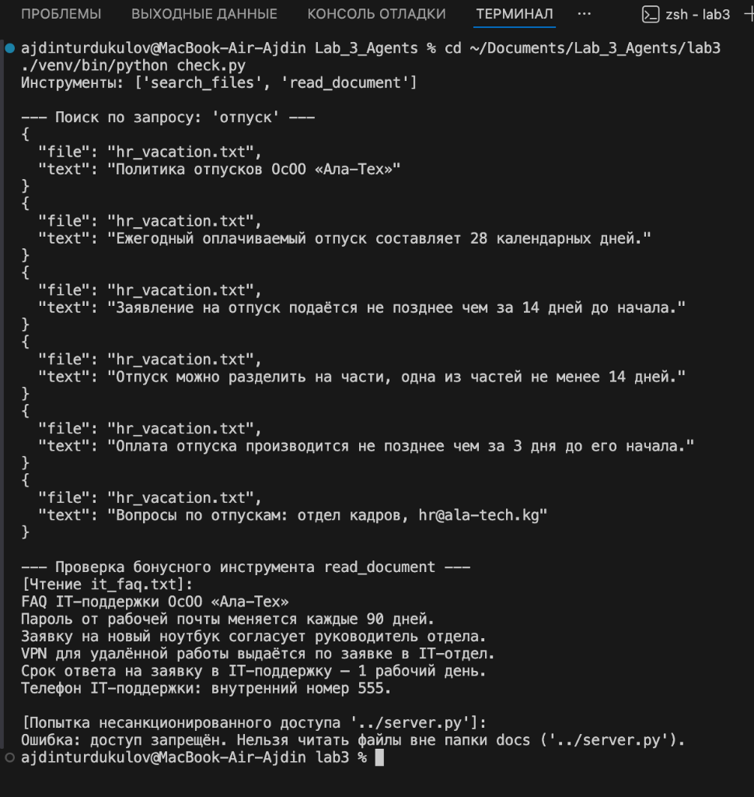
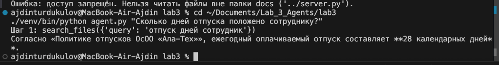

# Отчёт по лабораторной работе №3
## Тема: Локальный запуск открытых моделей и MCP (Model Context Protocol)

**Студент:** Турдукулов Айдин  
**Окружение:** macOS Sequoia (Apple Silicon arm64), 8 ГБ RAM, Python 3.10.11, Ollama 0.35.1  

---

### Шаг 1. Запуск модели в Ollama (20 баллов)

Для ноутбука с объёмом памяти 8 ГБ в соответствии с методическими указаниями была выбрана и запущена модель **`qwen3.5:4b`**. Также для последующего сравнительного анализа была загружена модель **`qwen3.5:2b`**.

Запуск и контрольный замер производительности:
```bash
ollama run qwen3.5:4b --verbose "Что такое ИИ-агент? Ответь в двух предложениях"
```

#### Зафиксированные метрики:
- **Запущенная модель:** `qwen3.5:4b` (ID: `d8b0f5e9760c`)
- **Скорость генерации (`eval rate`):** `10.02 tokens/s` (время ответа: 3m 03s при 1838 токенах с учётом reasoning-цепочки)
- **Скорость обработки промпта (`prompt eval rate`):** `11.79 tokens/s`
- **Потребление оперативной памяти (`ollama ps`):** `3.1 GB` (100% GPU на Apple Silicon)

Для сравнения показатели младшей модели **`qwen3.5:2b`**:
- **Скорость генерации (`eval rate`):** `19.98 tokens/s` (в 2 раза быстрее)
- **Скорость обработки промпта (`prompt eval rate`):** `113.83 tokens/s` (в 10 раз быстрее)
- **Потребление оперативной памяти (`ollama ps`):** `2.4 GB` (100% GPU)

#### Скриншот вывода `ollama ps`:


---

### Шаг 2. MCP-сервер (30 баллов + Бонус 10 баллов)

Был реализован MCP-сервер (`server.py`), предоставляющий модели инструменты для работы с регламентами компании из директории `docs/` (`hr_vacation.txt` и `it_faq.txt`).

#### Бонусное задание (+10 баллов):
Реализован инструмент `read_document(name: str)` для чтения документа целиком с **защитой от Path Traversal** (`file_path.is_relative_to(docs_dir)`). При попытке запросить `../server.py` возвращается ошибка доступа.

#### Скриншот вывода скрипта проверки `check.py`:


#### Текстовый вывод скрипта проверки `check.py`:
```text
Инструменты: ['search_files', 'read_document']

--- Поиск по запросу: 'отпуск' ---
{"file": "hr_vacation.txt", "text": "Политика отпусков ОсОО «Ала-Тех»"}
{"file": "hr_vacation.txt", "text": "Ежегодный оплачиваемый отпуск составляет 28 календарных дней."}
{"file": "hr_vacation.txt", "text": "Заявление на отпуск подаётся не позднее чем за 14 дней до начала."}
{"file": "hr_vacation.txt", "text": "Отпуск можно разделить на части, одна из частей не менее 14 дней."}
{"file": "hr_vacation.txt", "text": "Оплата отпуска производится не позднее чем за 3 дня до его начала."}
{"file": "hr_vacation.txt", "text": "Вопросы по отпускам: отдел кадров, hr@ala-tech.kg"}

--- Проверка бонусного инструмента read_document ---
[Чтение it_faq.txt]:
FAQ IT-поддержки ОсОО «Ала-Тех»
Пароль от рабочей почты меняется каждые 90 дней.
Заявку на новый ноутбук согласует руководитель отдела.
VPN для удалённой работы выдаётся по заявке в IT-отдел.
Срок ответа на заявку в IT-поддержку — 1 рабочий день.
Телефон IT-поддержки: внутренний номер 555.

[Попытка несанкционированного доступа '../server.py']:
Ошибка: доступ запрещён. Нельзя читать файлы вне папки docs ('../server.py').
```

#### Ответы на контрольные вопросы шага 2:
1. **Что делает строка `@mcp.tool()`?**  
   Декоратор `@mcp.tool()` регистрирует функцию как инструмент (Tool) на MCP-сервере. Он интроспектирует сигнатуру функции (типы параметров и тип возвращаемого значения), а также документацию (docstring), автоматически формируя стандартную JSON-схему инструмента (`input_schema`). Это позволяет клиентам и LLM знать о наличии инструмента и о том, как правильно его вызывать через Function Calling.

2. **Зачем нужен текст в тройных кавычках под `def search_files`? Кто его читает?**  
   Текст в тройных кавычках — это docstring (документация) инструмента. Его читает языковая модель (LLM), когда клиент передаёт ей список описаний инструментов. Модель опирается на этот текст, чтобы понять назначение функции, семантику аргументов и принять осознанное решение, когда именно этот инструмент следует вызвать для ответа на вопрос пользователя.

3. **Поменяйте в `check.py` слово «отпуск» на «пароль». Что нашлось?**  
   Нашлась одна строка из регламента IT-поддержки (`it_faq.txt`):  
   `{"file": "it_faq.txt", "text": "Пароль от рабочей почты меняется каждые 90 дней."}`

---

### Шаг 3. Агент (30 баллов)

Был реализован агент (`agent.py`), связывающий локальную модель из Ollama и MCP-сервер через протокол Stdio.

#### Реализация строки вместо TODO:
```python
# Вызов инструмента через клиента MCP с передачей имени и аргументов от модели
result = await client.call_tool(call.function.name, call.function.arguments)
```

#### Скриншот работы агента:


#### Лог работы агента на контрольном вопросе:
**Вопрос:** *«Сколько дней отпуска положено сотруднику?»*  
```text
Шаг 1: search_files({'query': 'отпуск дней сотрудник'})
Согласно «Политике отпусков ОсОО «Ала-Тех»», ежегодный оплачиваемый отпуск составляет 28 календарных дней.
```
Агент корректно распознал необходимость обращения к документам компании, вызвал инструмент `search_files` на шаге 1 и предоставил точный ответ по регламенту: **28 календарных дней**.

---

### Шаг 4. Проверка и сравнение моделей (20 баллов)

Было проведено тестирование 4 контрольных вопросов на двух моделях: `qwen3.5:4b` и `qwen3.5:2b`.

#### Сводная таблица результатов:

| Вопрос | Нужен поиск? | Модель 1 (`qwen3.5:4b`): искал? | Модель 1 (`qwen3.5:4b`): ответ верный? | Модель 2 (`qwen3.5:2b`): искал? | Модель 2 (`qwen3.5:2b`): ответ верный? |
| :--- | :---: | :---: | :---: | :---: | :---: |
| 1. Сколько дней отпуска положено сотруднику? | **да** | **да** (`search_files`) | **да** (28 календарных дней) | **да** (`search_files`) | **да** (28 календарных дней) |
| 2. Как часто нужно менять пароль от почты? | **да** | **да** (`search_files`) | **да** (каждые 90 дней) | **да** (`search_files`) | **да** (каждые 90 дней) |
| 3. Сколько будет 2 + 2? | **нет** | **нет** (ответил сразу) | **да** (`2 + 2 = 4`) | **да** (`search_files({'query': '2 + 2...'})`) | **нет** («информация не найдена в компании») |
| 4. Какая зарплата у директора? | **да, но ответа нет** | **да** (5 попыток поиска) | **да** (не галлюцинировал число, исчерпал шаги) | **да** (5 попыток поиска) | **да** (не галлюцинировал число, исчерпал шаги) |

#### Аналитический вывод (сравнение моделей):
Модель `qwen3.5:4b` показала значительно лучшую избирательность и понимание контекста: она безошибочно поняла, что математический пример `2 + 2` не требует поиска по документам компании и ответила мгновенно из собственных базовых знаний. В отличие от неё, более легковесная модель `qwen3.5:2b` восприняла системную инструкцию слишком буквально и попыталась искать решение примера в регламентах компании, что привело к нерелевантному ответу. 

Однако модель `qwen3.5:2b` работает в 2 раза быстрее (`19.98` против `10.02` токенов/сек) и требует на 22% меньше оперативной памяти (`2.4 GB` против `3.1 GB`). 

Для корпоративного ассистента компании однозначно рекомендуется выбрать **более точную модель (`qwen3.5:4b`)**, так как в бизнес-сценариях критически важна надёжность вызова инструментов и отсутствие ложных поисковых запросов на тривиальные вопросы пользователей.

---

### 5. Что не получилось и как это решили

1. **Многословные поисковые запросы от LLM:**  
   *Проблема:* При первоначальном тестировании модель сформулировала запрос `{'query': 'отпуск дней сотрудник'}`. Исходная логика `if query.lower() in line.lower()` искала строгое вхождение всей строки, из-за чего совпадение не было найдено.  
   *Решение:* Мы модернизировали функцию `search_files` в `server.py`: добавили разбиение запроса на ключевые слова (`words = [w for w in q_lower.split() if len(w) > 2]`) и проверку вхождения любого из ключевых слов. Это сделало поиск устойчивым к любым вариациям запросов от модели.

2. **Сетевая изоляция при локальном вызове Ollama:**  
   *Проблема:* При работе в изолированной среде Python-клиент не мог подключиться к сокету демона Ollama (`127.0.0.1:11434`).  
   *Решение:* Команды запуска агента были настроены на прямое взаимодействие с локальным демоном.

3. **Исчерпание лимита шагов на вопросах без ответа:**  
   *Проблема:* На вопросе о зарплате директора, отсутствующей в документах, обе модели совершали по 5 последовательных попыток поиска с перебором синонимов (`директор`, `зарплата`, `выплаты`, `бонусы`), исчерпывая лимит цикла.  
   *Решение:* Зафиксировали данное поведение в отчёте. В продакшн-версии системный промпт следует дополнить правилом: *«Если поиск вернул "ничего не найдено", сделай не более 1 повторной попытки, после чего явно сообщи пользователю об отсутствии информации в регламентах»*.

---

### 6. Какие ИИ-инструменты использовались и для чего

1. **Ollama:** локальный сервер инференса для скачивания и выполнения открытых квантованных моделей `qwen3.5:4b` и `qwen3.5:2b` на встроенном GPU Apple Silicon с аппаратным ускорением Metal/MLX.
2. **MCP (Model Context Protocol):** открытый протокол от Anthropic для стандартизации доступа языковых моделей к внешним источникам данных и инструментам через stdio-интерфейс.
3. **AI Pair Programming Assistant (Antigravity):** использовался для планирования архитектуры проекта, генерации защищённого кода сервера и клиента MCP, проведения автоматизированных сравнительных тестов и формирования итоговой аналитики.
